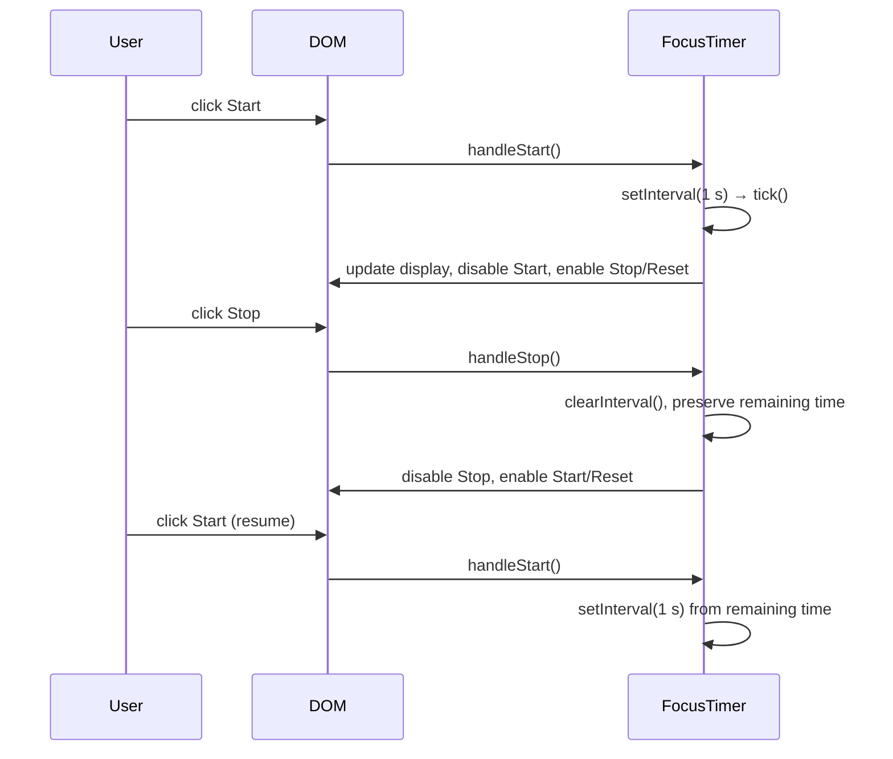
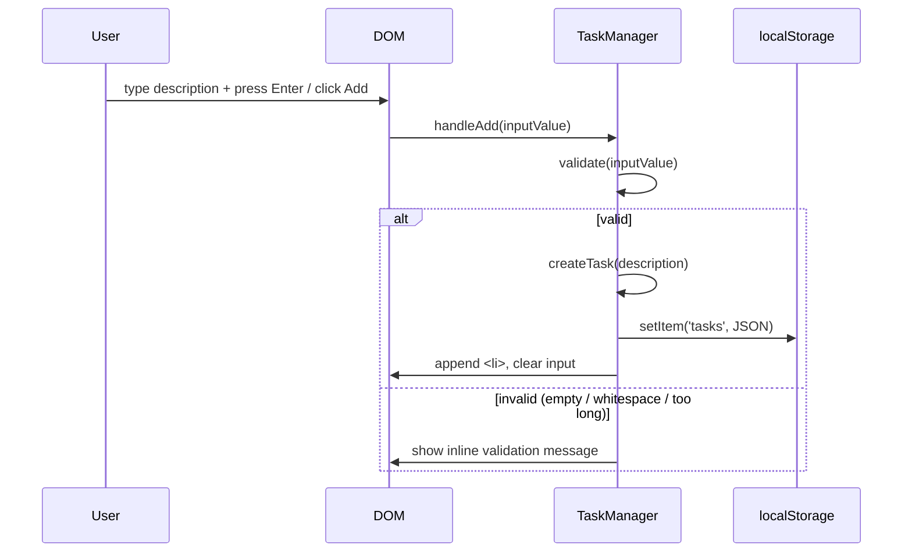

# Design Document — Todo Life Dashboard

## Overview

The Todo Life Dashboard is a zero-dependency, single-page productivity app delivered as a static HTML file. It runs entirely in the browser with no build step, no server, and no external network requests. All state is persisted to `localStorage`.

The application is composed of four independent panels rendered in a responsive CSS Grid layout:

| Panel | Responsibility |
|---|---|
| Greeting Panel | Live clock, date, and time-of-day greeting |
| Focus Timer | 25-minute Pomodoro countdown with start / stop / reset |
| Task Manager | Full CRUD to-do list persisted in `localStorage` |
| Quick Links | User-defined URL shortcuts persisted in `localStorage` |

**Key design decisions:**

- **Single HTML file + one CSS file + one JS file** — mandated by Requirement 14.2. All logic lives in `js/app.js`; all styles in `css/styles.css`.
- **No framework** — the UI is driven by direct DOM manipulation and the browser's built-in APIs (`Date`, `setInterval`, `localStorage`, `Audio`).
- **Module pattern via IIFE** — each panel is managed by its own namespaced object within `app.js` to keep concerns separated without requiring ES modules or a bundler.
- **Event delegation** — the Task Manager and Quick Links Panel attach a single listener to their container `<ul>` / `<div>` rather than per-item listeners, so dynamically added items are covered automatically.
- **`localStorage` as the source of truth** — every mutating operation writes the full array back to `localStorage` immediately; on page load the DOM is rebuilt from `localStorage`.

---

## Architecture

### File Structure

```
todo-life-dashboard/
├── index.html          # Single entry point; all markup
├── css/
│   └── styles.css      # All styles (layout, themes, components)
└── js/
    └── app.js          # All application logic (IIFEs per panel + init)
```

### Module Boundaries (inside `app.js`)

```
app.js
├── GreetingPanel   — clock/date display + greeting
├── FocusTimer      — countdown state machine + audio alert
├── TaskManager     — task CRUD + localStorage serialisation
├── QuickLinks      — link CRUD + localStorage serialisation
└── init()          — bootstraps all four modules on DOMContentLoaded
```

Each module exposes only an `init()` method to the outer scope; everything else is private to its IIFE closure.

### Runtime Flow

```
DOMContentLoaded
  └─ init()
       ├─ GreetingPanel.init()   → setInterval(60 s) for clock + greeting
       ├─ FocusTimer.init()      → renders controls; no interval started yet
       ├─ TaskManager.init()     → reads localStorage, renders task list
       └─ QuickLinks.init()      → reads localStorage, renders link buttons
```

### Sequence Diagram — Timer Start/Stop



### Sequence Diagram — Task Add



---

## Components and Interfaces

### 1. Greeting Panel (`GreetingPanel`)

**DOM targets:** `#greeting-text`, `#clock`, `#date`

**Public interface:**
```js
GreetingPanel.init()   // called once on page load
```

**Internal:**
```js
// called every 60 s via setInterval + immediately on init
function update() {
  const now = new Date();
  renderClock(now);   // → "14:07"
  renderDate(now);    // → "Saturday, 10 October 2026"
  renderGreeting(now); // → "Good Morning" | "Good Afternoon" | "Good Evening"
}
```

**Greeting logic:**

| Hour range | Message |
|---|---|
| 00 – 11 | Good Morning |
| 12 – 17 | Good Afternoon |
| 18 – 23 | Good Evening |

---

### 2. Focus Timer (`FocusTimer`)

**DOM targets:** `#timer-display`, `#btn-start`, `#btn-stop`, `#btn-reset`

**State machine:**

```
         ┌──────────┐
  load   │  IDLE    │ ←─── reset
         └────┬─────┘
              │ start
         ┌────▼─────┐
         │ RUNNING  │ ←─── start (resume)
         └────┬─────┘
              │ stop        │ reach 00:00
         ┌────▼─────┐  ┌───▼──────┐
         │  PAUSED  │  │ FINISHED │
         └──────────┘  └──────────┘
```

**Control enable/disable per state:**

| State | Start | Stop | Reset |
|---|---|---|---|
| IDLE | ✅ enabled | ❌ disabled | ✅ enabled |
| RUNNING | ❌ disabled | ✅ enabled | ✅ enabled |
| PAUSED | ✅ enabled | ❌ disabled | ✅ enabled |
| FINISHED | ✅ enabled | ❌ disabled | ✅ enabled |

**Public interface:**
```js
FocusTimer.init()
```

**Internal:**
```js
let state = 'IDLE';           // 'IDLE' | 'RUNNING' | 'PAUSED' | 'FINISHED'
let remainingSeconds = 1500;  // 25 * 60
let intervalId = null;

function tick() {
  remainingSeconds--;
  renderDisplay(remainingSeconds);
  if (remainingSeconds <= 0) finish();
}

function finish() {
  clearInterval(intervalId);
  state = 'FINISHED';
  showCompletionIndicator();
  playAlert();          // new Audio(DATA_URI).play()
  syncControls();
}
```

**Audio alert:** A short beep encoded as a Base64 WAV data URI stored as a constant in `app.js` to avoid any external network request.

---

### 3. Task Manager (`TaskManager`)

**DOM targets:** `#task-input`, `#btn-add-task`, `#task-list`, `#task-validation-msg`

**Public interface:**
```js
TaskManager.init()
```

**Internal operations:**

| Operation | Trigger | Validation |
|---|---|---|
| `addTask(desc)` | Enter key / Add button | Non-empty, non-whitespace, ≤ 200 chars |
| `editTask(id, desc)` | Edit button confirm | Non-empty, non-whitespace, ≤ 500 chars |
| `deleteTask(id)` | Delete button | — |
| `toggleTask(id)` | Completion checkbox | — |
| `cancelEdit()` | Cancel button / open another edit | — |

**Rendering:** Each task `<li>` is re-rendered from the in-memory array after every mutation. The array is also written back to `localStorage` on every mutation.

**Edit-mode invariant:** At most one task is in edit mode at any time. Opening a second edit implicitly cancels the first.

---

### 4. Quick Links Panel (`QuickLinks`)

**DOM targets:** `#link-label-input`, `#link-url-input`, `#btn-add-link`, `#links-container`

**Public interface:**
```js
QuickLinks.init()
```

**Internal operations:**

| Operation | Trigger | Validation |
|---|---|---|
| `addLink(label, url)` | Add button | Non-empty label ≤ 100 chars; non-empty URL ≤ 2048 chars starting with `http://` or `https://` |
| `deleteLink(id)` | Delete button | — |
| `openLink(url)` | Link button click | URL must be non-empty; catch `window.open` blocked |

**Label truncation:** Labels longer than 50 characters are truncated to 50 chars with `…` appended in the button's visible text; the full label is stored in `localStorage`.

---

## Data Models

### `localStorage` Key Schema

| Key | Type | Description |
|---|---|---|
| `"tdl_tasks"` | `Task[]` | Serialised JSON array of all tasks |
| `"tdl_links"` | `Link[]` | Serialised JSON array of all quick links |

Using a namespaced prefix (`tdl_`) avoids collisions with other apps sharing the same origin.

---

### Task

```ts
interface Task {
  id: string;          // UUID v4 generated at creation time (crypto.randomUUID())
  description: string; // 1–200 characters; trimmed before storage
  completed: boolean;  // false by default
  createdAt: number;   // Unix timestamp ms (Date.now()) — used for stable ordering
}
```

**Serialisation example:**
```json
[
  {
    "id": "a1b2c3d4-...",
    "description": "Buy groceries",
    "completed": false,
    "createdAt": 1728537600000
  }
]
```

**Ordering:** Tasks are displayed in insertion order (array order in `localStorage`). New tasks are appended to the end of the array.

---

### Link

```ts
interface Link {
  id: string;    // UUID v4 generated at creation time
  label: string; // 1–100 characters; stored full, truncated only in display
  url: string;   // 1–2048 characters; must start with http:// or https://
}
```

**Serialisation example:**
```json
[
  {
    "id": "e5f6g7h8-...",
    "label": "GitHub",
    "url": "https://github.com"
  }
]
```

**Ordering:** Links are displayed in insertion order (same as Tasks).

---

### `localStorage` Read/Write Strategy

```js
// Read (on init)
function loadTasks() {
  try {
    const raw = localStorage.getItem('tdl_tasks');
    return raw ? JSON.parse(raw) : [];
  } catch (e) {
    showStorageError('Could not load saved tasks.');
    return [];
  }
}

// Write (after every mutation)
function saveTasks(tasks) {
  try {
    localStorage.setItem('tdl_tasks', JSON.stringify(tasks));
  } catch (e) {
    showStorageError('Data could not be saved.');
  }
}
```

The same pattern is used for Links. All writes are synchronous and wrapped in `try/catch` to handle `SecurityError` (private browsing) and `QuotaExceededError`.

---

## Correctness Properties

*A property is a characteristic or behavior that should hold true across all valid executions of a system — essentially, a formal statement about what the system should do. Properties serve as the bridge between human-readable specifications and machine-verifiable correctness guarantees.*

### Property 1: Greeting corresponds to hour

*For any* local hour value (0–23), the greeting returned by the greeting logic SHALL be exactly "Good Morning" for hours 0–11, "Good Afternoon" for hours 12–17, and "Good Evening" for hours 18–23 — with no hour value producing more than one greeting or an unrecognised string.

**Validates: Requirements 2.1, 2.2, 2.3, 2.4**

---

### Property 2: Time formatting round-trip

*For any* valid `Date` object, formatting it to the HH:MM string and then parsing the two fields back into hours and minutes SHALL yield the same hour and minute values as the original `Date`.

**Validates: Requirements 1.1**

---

### Property 3: Adding a task grows the list by exactly one

*For any* non-empty, non-whitespace-only description of 1–200 characters and any existing task list, adding that task SHALL produce a new list whose length is exactly one greater than the original list, and the new task SHALL be the last element.

**Validates: Requirements 5.2, 5.5**

---

### Property 4: Whitespace and over-limit inputs are rejected

*For any* string that is empty, composed entirely of whitespace, or exceeds 200 characters, submitting it as a new task description SHALL leave the task list unchanged.

**Validates: Requirements 5.3, 5.4**

---

### Property 5: Task persistence round-trip

*For any* array of Task objects, serialising to `localStorage` and then deserialising SHALL produce an array that is structurally equal to the original — with every `id`, `description`, `completed`, and `createdAt` field preserved exactly.

**Validates: Requirements 9.1, 9.2**

---

### Property 6: Completion toggle is its own inverse

*For any* task list and any task in that list, toggling the task's completion status twice SHALL return the task to its original completion status.

**Validates: Requirements 7.2, 7.3**

---

### Property 7: Edit preserves all other tasks

*For any* task list and any valid edited description for one task, applying the edit SHALL leave every other task in the list unchanged (same `id`, `description`, `completed`, `createdAt`).

**Validates: Requirements 6.3**

---

### Property 8: Delete removes exactly the target task

*For any* task list and any task `id` in that list, deleting that task SHALL produce a list that contains every task from the original list except the deleted one — preserving order and all field values of the remaining tasks.

**Validates: Requirements 8.2, 8.3**

---

### Property 9: URL validation accepts only http/https

*For any* string, the URL validator SHALL accept it if and only if the string starts with `http://` or `https://` (case-sensitive). All other strings — including empty strings, relative paths, `ftp://`, `//`, or strings with leading whitespace — SHALL be rejected.

**Validates: Requirements 10.2, 10.4**

---

### Property 10: Link label display truncation

*For any* link label string, the display text SHALL be at most 50 characters. If the original label is longer than 50 characters, the display text SHALL be the first 50 characters followed by `…`. If the original label is 50 characters or fewer, the display text SHALL equal the original label exactly.

**Validates: Requirements 11.2**

---

### Property 11: Link persistence round-trip

*For any* array of Link objects, serialising to `localStorage` and then deserialising SHALL produce an array that is structurally equal to the original — with every `id`, `label`, and `url` field preserved exactly.

**Validates: Requirements 13.1**

---

### Property 12: Timer countdown decrements monotonically

*For any* starting value of `remainingSeconds` > 0, each call to `tick()` SHALL decrease `remainingSeconds` by exactly 1 and update the display to the new value, until `remainingSeconds` reaches 0 and the timer stops.

**Validates: Requirements 3.2, 3.3, 3.4**

---

### Property 13: Timer display formatting

*For any* integer `remainingSeconds` in the range [0, 1500], the formatted display string SHALL match `MM:SS` where MM = `Math.floor(remainingSeconds / 60)` zero-padded to 2 digits and SS = `remainingSeconds % 60` zero-padded to 2 digits.

**Validates: Requirements 3.1, 3.3**

---

## Error Handling

### `localStorage` Unavailability

All reads and writes are wrapped in `try/catch`. When an error is caught:
- A non-blocking inline error banner (`#storage-error-banner`) is shown in the relevant panel.
- The application continues to function in-memory for the current session (data will not survive a reload).
- On page load failure, an empty list is rendered (Requirements 9.3, 9.5, 13.2, 13.3).

### Timer Edge Cases

- If `tick()` fires after `remainingSeconds` is already 0 (race condition on slow CPUs), the guard `if (remainingSeconds <= 0) finish()` prevents negative display values.
- Clicking Start when `state === 'RUNNING'` is a no-op (Requirement 3.5).

### Link Open Failure

`window.open()` returns `null` if the browser blocks the popup. The return value is checked, and if `null`, an inline error message is shown (Requirement 11.4).

### Malformed `localStorage` Data

`JSON.parse()` is wrapped in `try/catch`. If parsing fails (malformed data), an empty array is used and an error message is displayed (Requirement 13.3).

---

## Testing Strategy

### Unit Tests (Example-Based)

Unit tests cover concrete, deterministic scenarios:

- **GreetingPanel:** `getGreeting(hour)` for exactly hours 0, 11, 12, 17, 18, 23 — boundary values.
- **GreetingPanel:** `formatClock(date)` for midnight, noon, and single-digit minute.
- **GreetingPanel:** `formatDate(date)` for a known date against expected string.
- **FocusTimer:** `formatDisplay(seconds)` for 1500 → "25:00", 0 → "00:00", 61 → "01:01".
- **FocusTimer:** State transitions — start from IDLE, stop from RUNNING, reset from RUNNING, finish at 0.
- **TaskManager:** `validateDescription(value)` with `""`, `"  "`, 200-char string, 201-char string, valid string.
- **TaskManager:** `editTask` with empty value is rejected; cancel restores original.
- **TaskManager:** At most one task in edit mode at a time.
- **QuickLinks:** `validateUrl(value)` with `""`, `"ftp://x"`, `"http://x"`, `"https://x"`, `"//x"`.
- **QuickLinks:** `truncateLabel(label, 50)` for labels of length 0, 50, 51, 100.
- **localStorage helpers:** Read when key absent returns `[]`; read of malformed JSON returns `[]`.

### Property-Based Tests

Property-based tests use **fast-check** (JavaScript PBT library) configured to run a minimum of **100 iterations per property**.

Each test is tagged with a comment in the format:
`// Feature: todo-life-dashboard, Property N: <property_text>`

**Properties to implement:**

| Test | Property | Library Arbitraries |
|---|---|---|
| Greeting corresponds to hour | Property 1 | `fc.integer({ min: 0, max: 23 })` |
| Time formatting round-trip | Property 2 | `fc.date()` |
| Add task grows list by 1 | Property 3 | `fc.string({ minLength: 1, maxLength: 200 })` (filtered non-whitespace) + `fc.array(taskArb)` |
| Whitespace/over-limit rejected | Property 4 | `fc.string()` filtered to whitespace-only or length > 200 |
| Task persistence round-trip | Property 5 | `fc.array(taskArb)` |
| Completion toggle is inverse | Property 6 | `fc.array(taskArb, { minLength: 1 })` + `fc.integer` index |
| Edit preserves other tasks | Property 7 | `fc.array(taskArb, { minLength: 1 })` + index + valid desc |
| Delete removes exactly one | Property 8 | `fc.array(taskArb, { minLength: 1 })` + index |
| URL validation | Property 9 | `fc.string()` |
| Label truncation | Property 10 | `fc.string({ maxLength: 200 })` |
| Link persistence round-trip | Property 11 | `fc.array(linkArb)` |
| Timer decrements monotonically | Property 12 | `fc.integer({ min: 1, max: 1500 })` |
| Timer display formatting | Property 13 | `fc.integer({ min: 0, max: 1500 })` |

**Test file location:** `js/app.test.js` (run with a test runner such as Vitest or Jest).

**PBT configuration:**
```js
fc.configureGlobal({ numRuns: 100 });
```

### Integration / Smoke Tests

- **Storage unavailable:** Mock `localStorage.setItem` to throw `DOMException`; verify error banner appears and in-memory state is preserved.
- **Link open blocked:** Mock `window.open` to return `null`; verify error message appears.
- **Cross-panel independence:** Mutating tasks does not affect links in `localStorage`, and vice versa.
